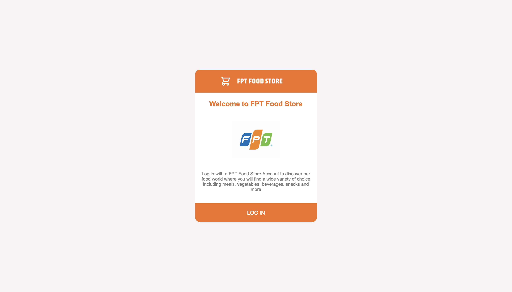
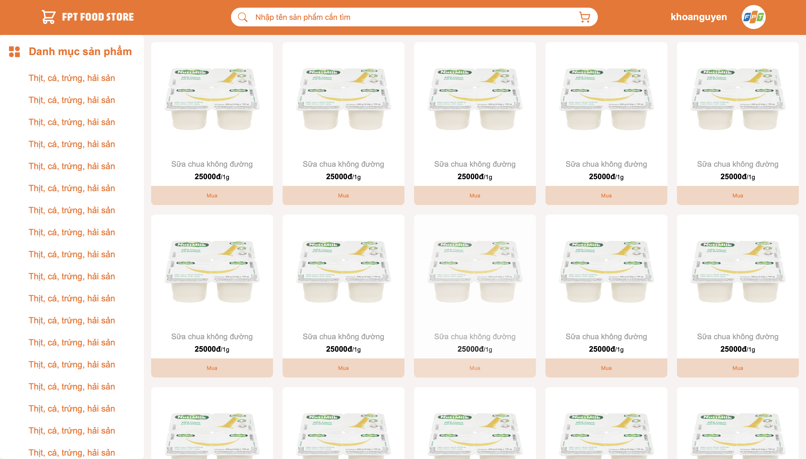

# FPT Food Store
A simple food store website 
# Requirements
+ Java 21
+ Maven
+ Node 
# Installation
1. clone the repo
```bash
git clone https://github.com/Nguyen-Dang-Khoa-04072004/oauth2-spring-security
```
2. install dependencies for client app
```bash
cd client-app
npm install
```
3. run the client app
```bash
npm run dev
```
4. run the authorization server
```bash
cd authorization-sever
mvn spring-boot:run
```
5. run the resource server
```bash
cd resource server
mvn spring-boot:run
```
# DOCUMENTS
+ [API Specification](./docs/API.md)
+ [Data Dictionary](./docs/data-dictionary.md)
+ [Sequence Diagram](./images/sequence-diagram.png)
+ [ERD Diagram](./images/erd-diagram-v1.png)

# SCREEN SHOTS
## LANDING PAGE

## PRODUCT PAGE

# DEMO 
## Login with Oauth Client